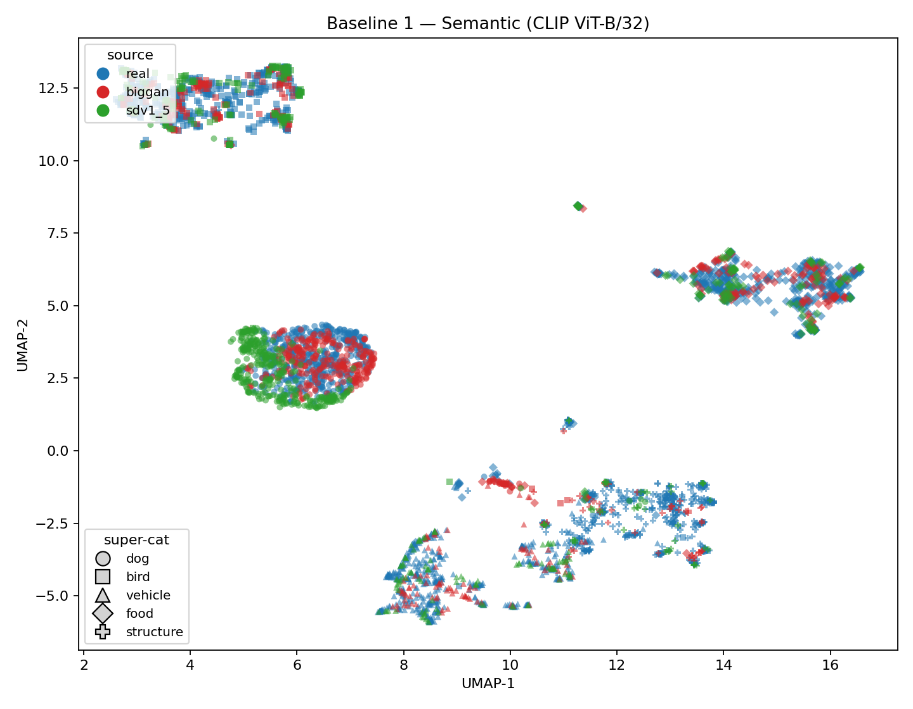
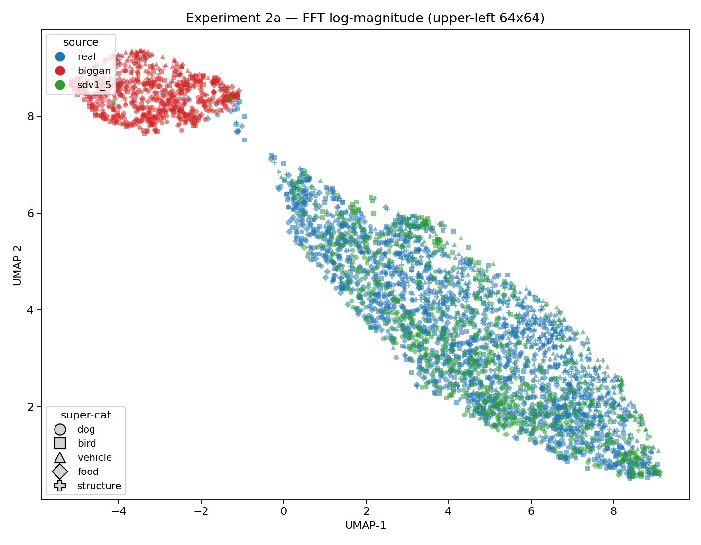
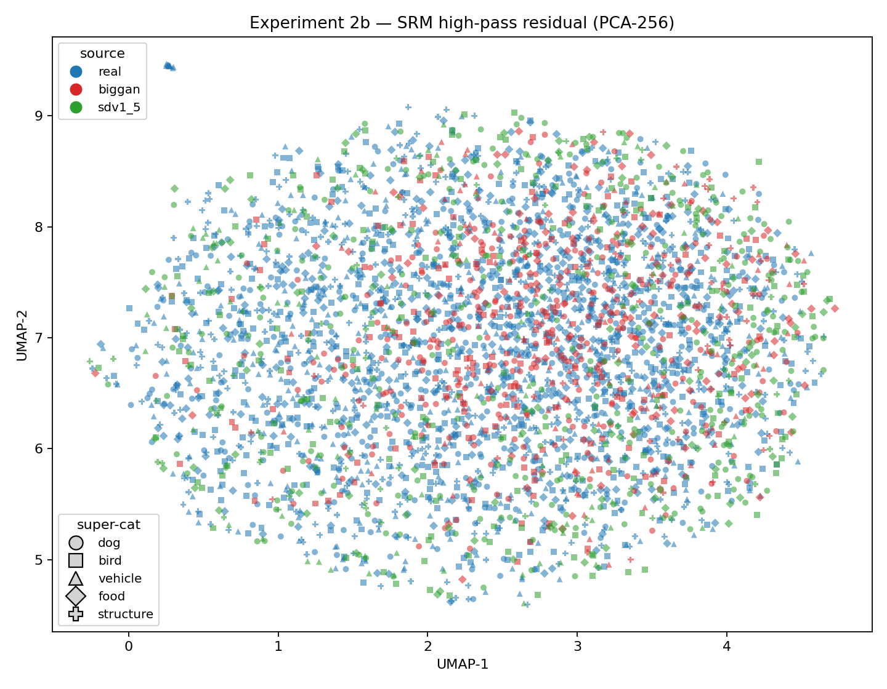

# 📋 Research Writeup

## ❓ Question
Do generation methods share a common artifact signature that is consistently separable from the artifact space of real camera pipelines? Is synthetic image content sufficiently homogeneous across generation methods to be treated as a single detectable class?

## 💭 Thought Process
I was reading a paper on a comparative benchmark analysis between generated-images detection methods where they intended to show that generalization across different synthetic mechanisms (difussion and GAN in this case) was still very low. Initially, I agreed with this being an open problem but then I further thought about it: are we actually tackling something that should be thought of as a "single class"? For us, "fake" and "real" has a very clear definition in the sense that people taking pictures from the "real world" can be considered as real. But these are no more than pixels obtained via camera. How do we identify properly all the potential marks from this "real class" that we can find? is this possible?

## 🔲 Simplifications & Assumptions
- **Modalities dropped**: scope is images only; other modalities (audio, text, video) were set aside as they complicate the problem independently
- **Distributional framing ruled out**: generative models are explicitly trained to minimize the distributional gap with real data, so distributional separability (should) collapse by construction.
- **Artifacts as the operative definition of homogeneity**: "homogeneous enough" means sharing a common artifact signature, not distributional proximity
- **Real images are not a clean reference class**: camera-captured images carry their own pipeline-specific traces, so the problem is framed as *camera-pipeline artifacts vs. generation-pipeline artifacts*, not simply real vs. fake
- **Single-class validity hinges on artifact overlap**: if generation methods produce disjoint artifacts (overlap does not actually exist) or artifacts that partially overlap with camera then the single-class assumption fails and detection might be treated as method-specific.

## 🧪 Experiment Idea

### Data
- **Real**: N≥3 categories from a real-camera dataset (e.g. ImageNet, COCO) — treated as one "real pipeline" class (camera metadata not controlled; acknowledged as a limitation)
- **Synthetic**: same N content categories generated by at least two mechanisms — GAN-based and diffusion-based (sourced from HuggingFace models)

### Feature extraction

| Step | Feature extractor | Purpose |
|---|---|---|
| Baseline 1 | CLIP | Semantic embeddings, to confirm that fakes cluster by content |
| Exp. 2a | FFT magnitude spectrum (fftshift, mid-to-high freq) | Artifact-sensitive; to study frequency pipeline traces |
| Exp. 2b | Noise residuals (e.g. SRM filter) | Artifact-sensitive; to study pipeline noise traces |

### Baselines
- **Baseline 1 (semantic)**: UMAP on CLIP features. Expected: fakes cluster by content near real images of same category. Confirms distributional overlap and motivates artifact approach.
- **Baseline 2 (same-pipeline reference)**: In artifact feature space, compute pairwise distances across N real categories. Different content, same camera pipeline → should yield **small** distances. Establishes the reference for "same kind of pipeline."

### Experiments 2a / 2b
Run the same UMAP + distance analysis in FFT space (2a) and noise residual space (2b). The three distances of interest are:

| Comparison | Expected if single-class holds |
|---|---|
| fake-GAN vs. fake-diffusion | Small — similar to same-pipeline reference |
| real vs. fake (same content) | Large — different pipelines |
| real cat vs. real dog | Small — same camera pipeline, different semantics |

### Metrics
- UMAP for visual inspection
- Silhouette score and mean intra-class vs. inter-class distance for quantitative comparison

## 📊 Results

### Dataset (as actually run)
- **Synthetic**: BigGAN and Stable Diffusion v1.5 splits from `Qwerty0193/genimage-processed` (Tiny GenImage). There were 5 **"super-categories"** (`dog`, `bird`, `vehicle`, `food`, `structure`), defined by curated sets of ImageNet-1k classes.
- **Real**: `ILSVRC/imagenet-1k` validation split, filtered to the same 5 super-categories.
- **Final sample counts**:

  | source  | dog | bird | vehicle | food | structure |
  |---------|-----|------|---------|------|-----------|
  | real    | 500 | 500  | 500     | 500  | 500       |
  | BigGAN  | 290 | 143  | 101     | 124  | 55        |
  | SDv1.5  | 319 | 163  | 98      | 107  | 50        |

  Total: 3,950 images. All synthetic cells under the 500 cap use all available images, per the plan.

### Numbers
Mean pairwise L2 distance per feature space (see `results/metrics.csv`):

| measurement | CLIP | FFT | SRM |
|---|---:|---:|---:|
| intra (same source & super-category) | 0.84 | 42.26 | 3.36 |
| BigGAN vs SDv1.5 (same super-category) | 0.86 | **57.15** | 2.86 |
| real vs fake (same super-category) | 0.88 | 53.11 | 3.95 |
| real-super-category A vs real-super-category B | **1.03** | 47.72 | **5.10** |

The first row shows a baseline of the average spread inside one homogeneous super-category for a source (three sources × five super-categories). 

### What the UMAPs show

<table>
<tr>
<td align="center" width="33%"> <b>CLIP (semantic)</b></td>
<td align="center" width="33%"> <b>FFT (frequency)</b></td>
<td align="center" width="33%"> <b>SRM (noise residual)</b></td>
</tr>
</table>

## 🔎 Final Comments

From the UMAP visualizations we can see that these artifact feature spaces are no good to discern generated pipelines from "real images" capturing pipelines. SRM has total overlap and FFT shows overlap between diffusion generated images and images from ImageNet.

If we analyze mean L2 pairwise distances, we can see that the semantic distinction is not a good approach. The distributional shift approach here it is not a good first start for distinguishing synthetic vs. camera captured, meaning that Baseline 1 gave intended results.

In terms of experiments 2a and 2b, the biggest distancance in terms of FFT is the one between synthetic mechanisms, which could indicate that synthetc single class approach might not be feasible. On the other hand, SRM shows that biggest distance is actually between super-categories, supporting the mentioned conclusion.

It is a tiny indication that synthetic footprints might be more complex than a single "generated" label and that we would likely face a mouse-and-rat race, similar to anything related to security.

In terms of limitations that should be overcome to strengthen this tiny experiment, we can mention the following:
- Upon random visual inspection the images, it is possible to see that GAN generated ones are far lower quality than the ones produced with the diffusion model and they can't be considered state of the art. This is a big flaw.
- Only two synthetic mechanisms analyzed.
- Only two artifact spaces anaylzed. Requires better understanding of the possible approaches here.
- No specific information on diveristy of "real" camera pipelines.

As an experiment poking a question, it got a bit big in terms of things being evaluated.
